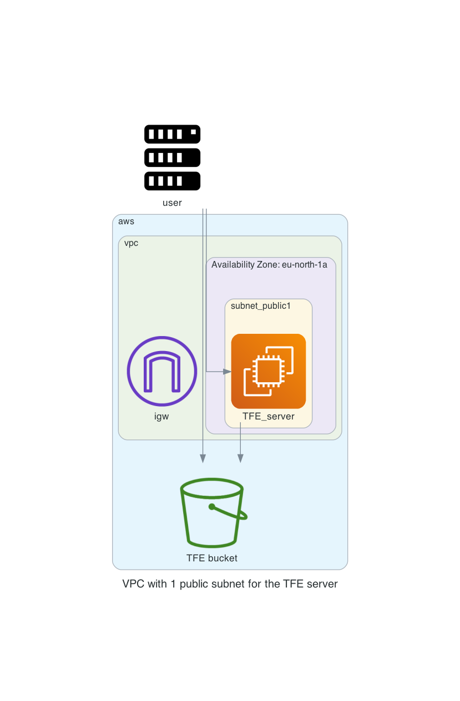

# Terraform Enterprise installation mounted disk

With this repository you will be able to do a TFE (Terraform Enterprise) online installation Mounted Disk

The Terraform code will do the following steps

- Create S3 buckets used for TFE to store certificates and licensing
- Generate TLS certificates with Let's Encrypt to be used by TFE
- Create a VPC network with subnet, security group, internet gateway
- Create a EC2 instance on which the TFE installation will be performed in mounted disk mode

# Diagram

  

# Prerequisites

## License
Make sure you have a TFE license available for use

Store this under the directory `files/license.rli`

## AWS
We will be using AWS. Make sure you have the following
- AWS account  
- Install AWS cli [See documentation](https://docs.aws.amazon.com/cli/latest/userguide/install-cliv2.html)

## Install terraform  
See the following documentation [How to install Terraform](https://learn.hashicorp.com/tutorials/terraform/install-cli)

## TLS certificate
You need to have valid TLS certificates that can be used with the DNS name you will be using to contact the TFE instance.  
  
The repo assumes you have no certificates and want to create them using Let's Encrypt and that your DNS domain is managed under AWS. 

# How to

- Clone the repository to your local machine
```
git clone https://github.com/munnep/TFE_aws_disk.git
```
- Go to the directory
```
cd TFE_aws_disk
```
- Set your AWS credentials
```
export AWS_ACCESS_KEY_ID=
export AWS_SECRET_ACCESS_KEY=
export AWS_SESSION_TOKEN=
```
- Store the files needed for the TFE installation under the `./files` directory, See the notes [here](./files/README.md)
- create a file called `variables.auto.tfvars` with the following contents and your own values
```
tag_prefix               = "patrick-disk"                             # TAG prefix for names to easily find your AWS resources
region                   = "eu-north-1"                               # Region to create the environment
vpc_cidr                 = "10.234.0.0/16"                            # subnet mask that can be used 
filename_license         = "license.rli"                              # filename of your TFE license stored under ./files
dns_hostname             = "patrick-tfe6"                             # DNS hostname for the TFE
dns_zonename             = "bg.hashicorp-success.com"                 # DNS zone name to be used
tfe_password             = "Password#1"                               # TFE password for the dashboard and encryption of the data
certificate_email        = "patrick.munne@hashicorp.com"              # Your email address used by TLS certificate registration
tfe_release_sequence     = "642"                                         # Which release sequence of TFE do you want to install
public_key               = "ssh-rsa AAAAB3Nza"                        # The public key for you to connect to the server over SSH
```
- Terraform initialize
```
terraform init
```
- Terraform plan
```
terraform plan
```
- Terraform apply
```
terraform apply
```
- Terraform output should create 30 resources and show you the public dns string you can use to connect to the TFE instance
```
Apply complete! Resources: 30 added, 0 changed, 0 destroyed.

Outputs:

ssh_tfe_server = "ssh ubuntu@patrick-tfe6.bg.hashicorp-success.com"
tfe_appplication = "https://patrick-tfe6.bg.hashicorp-success.com"
tfe_dashboard = "https://patrick-tfe6.bg.hashicorp-success.com:8800"
```
- Connect to the TFE dashboard. This could take 10 minutes before fully functioning
   
- Click on the open button to create your organization and workspaces


# TODO

# Done
- [x] add docker disk
- [x] build network according to the diagram
- [x] use standard ubuntu 
- [x] create a virtual machine in a public network with public IP address.
    - [x] firewall inbound are all from user building external ip
    - [x] firewall outbound rules
          AWS bucket
- [x] Create an AWS bucket
- [x] create an elastic IP to attach to the instance
- [x] transfer files to TFE virtual machine
      - license
      - TLS certificates
- [x] install TFE
- [x] Create a valid certificate to use 
- [x] point dns name to public ip address


# notes and links
[EC2 AWS bucket access](https://aws.amazon.com/premiumsupport/knowledge-center/ec2-instance-access-s3-bucket/)


